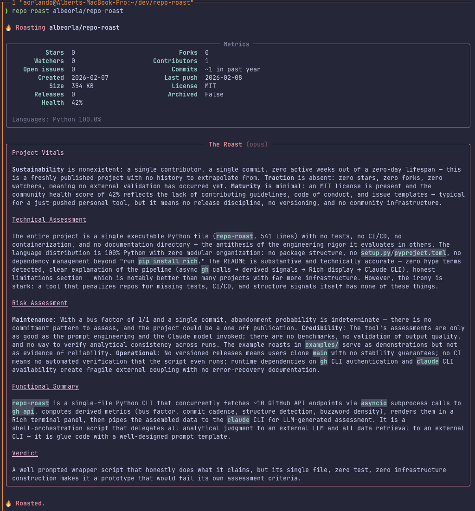

# repo-roast

CLI tool that roasts GitHub repositories. Fetches quantitative metrics via `gh`, derives analytical signals (bus factor, commit cadence, README hype density), then sends everything to Claude for a structured, evidence-based assessment — rendered in the terminal with Rich.

<p align="center">
  
</p>

## How it works

1. **Fetches repo data** concurrently via `gh api` (~10 async calls):
   - Core stats (stars, forks, watchers, issues)
   - Language breakdown, contributor list, commit participation
   - Release history, community health profile
   - Top-level file tree and README content

2. **Derives analytical signals** from raw data:
   - **Bus factor** — top contributor's share of recent commits
   - **Commit cadence** — active weeks, 12-week trend with acceleration detection
   - **Structure signals** — presence of tests, CI/CD, docs, containerization
   - **README hype analysis** — automated buzzword density scan against 30+ marketing terms

3. **Displays metrics** in a Rich-formatted panel.

4. **Sends all data to Claude** (via `claude` CLI) for assessment across five dimensions:
   - **Project Vitals** — sustainability, traction, and maturity signals
   - **Technical Assessment** — engineering rigor from observable artifacts
   - **Risk Assessment** — maintenance, credibility, and operational risks
   - **Functional Summary** — what it technically does, no aspirations
   - **Verdict** — one sentence, maximum precision

The LLM receives raw data and derived signals without pre-computed judgments to avoid confirmation bias.

## Requirements

- [`gh`](https://cli.github.com/) — GitHub CLI, authenticated
- [`claude`](https://docs.anthropic.com/en/docs/claude-code) — Claude Code CLI
- Python 3.9+
- [`rich`](https://github.com/Textualize/rich) — `pip install rich`

## Install

```bash
git clone https://github.com/albeorla/repo-roast.git
cd repo-roast
pip install rich
chmod +x repo-roast

# Add to PATH (optional)
echo 'export PATH="$PATH:'"$(pwd)"'"' >> ~/.zshrc
source ~/.zshrc
```

## Usage

```bash
repo-roast owner/repo
repo-roast https://github.com/owner/repo
repo-roast owner/repo --model sonnet
repo-roast owner/repo --no-llm     # metrics only
repo-roast owner/repo --json       # raw JSON
```

## Examples

See [examples/](examples/) for full roasts of real repos.

## Limitations

- Analysis quality depends on the Claude model. Opus (default) is thorough; `--model haiku` is faster but less nuanced.
- README truncated to 4,000 chars for context limits.
- `open_issues_count` from the GitHub API includes pull requests.
- Rate-limited to GitHub API limits (5,000 requests/hour authenticated).

## License

MIT
