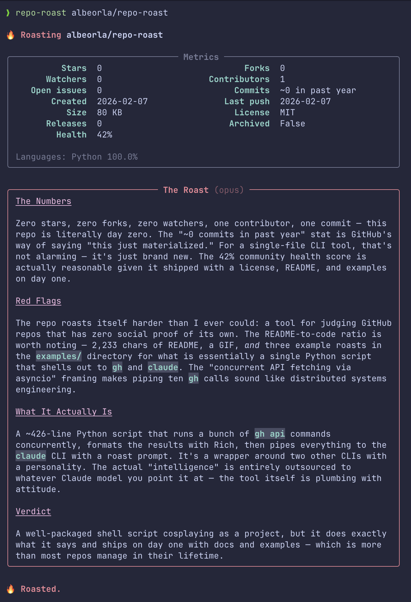

# repo-roast 🔥

CLI tool that roasts GitHub repositories. Fetches quantitative metrics via `gh`, then sends them to Claude for a sharp, honest assessment — complete with Rich-formatted terminal output and concurrent API fetching.

<p align="center">
  
</p>

## How it works

1. **Fetches repo data** concurrently from the GitHub API (~10 calls via `asyncio`):
   - Core stats (stars, forks, watchers, issues)
   - Language breakdown, contributor list, commit activity
   - Release history, community health profile
   - Top-level file tree and README content

2. **Displays metrics** in a styled panel via [Rich](https://github.com/Textualize/rich).

3. **Sends all data to Claude** (via `claude` CLI) for a roast across four dimensions:
   - **The Numbers** — what the stats mean once you strip away the vanity
   - **Red Flags** — buzzword bingo, README-to-code ratios, scope delusions
   - **What It Actually Is** — the marketing fairy dust removed
   - **Verdict** — one sentence, make it count

The LLM receives raw data without pre-computed judgments to avoid confirmation bias.

## Requirements

- [`gh`](https://cli.github.com/) — GitHub CLI, authenticated
- [`claude`](https://docs.anthropic.com/en/docs/claude-code) — Claude Code CLI
- Python 3.9+
- [`rich`](https://github.com/Textualize/rich) — `pip install rich`

## Install

```bash
git clone https://github.com/albeorla/repo-roast.git
cd repo-roast
pip install rich
chmod +x repo-roast

# Add to PATH
echo 'export PATH="$PATH:'"$(pwd)"'"' >> ~/.zshrc
source ~/.zshrc
```

## Usage

```bash
repo-roast owner/repo
repo-roast https://github.com/owner/repo
repo-roast owner/repo --model sonnet
repo-roast owner/repo --no-llm     # metrics only
repo-roast owner/repo --json       # raw JSON
```

## Examples

See [examples/](examples/) for full roasts of real repos.

## Limitations

- Analysis quality depends on the Claude model. Opus (default) is thorough; `--model haiku` is faster but less nuanced.
- README truncated to 4000 chars for context limits.
- `open_issues_count` from the GitHub API includes pull requests.
- Rate-limited to GitHub API limits (5000 requests/hour authenticated).

## License

MIT
